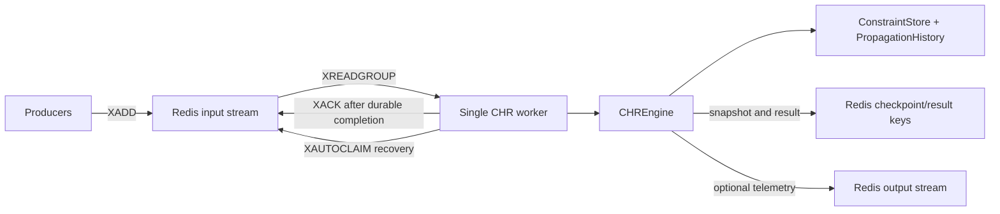

# Research Report: Using Redis with CHR.ts

**Date:** 2026-09-04  
**Scope:** Redis integration options for the TypeScript CHR engine in `CHR.ts`  
**Status:** Architecture research and implementation recommendation

## Executive Summary

Redis is a good complement to CHR.ts, but it should not replace the live in-memory constraint store in the first integration. CHR.ts currently relies on local insertion order, numeric constraint IDs, a local functor index, propagation history, and one engine instance being used from one async context. Moving the matching loop directly onto Redis would add network latency to every candidate lookup and make deterministic rule firing, atomic multi-step updates, and propagation-history consistency much harder to guarantee.

The recommended design is an **optional Redis adapter around the engine**:

1. Keep `ConstraintStore` and `PropagationHistory` authoritative during a fixpoint run.
2. Use Redis Streams for external constraint-ingress events and asynchronous worker coordination.
3. Persist completed engine snapshots and/or an append-only event log in Redis when operational recovery is needed.
4. Add Redis-backed indexes only after profiling shows the local store is a bottleneck.
5. Make Redis unavailable by default so the current zero-runtime-dependency package remains lightweight.

## Current CHR.ts Architecture

The package currently has no Redis dependency and advertises no runtime dependencies. The important local boundaries are:

- `CHREngine.assert()` and `assertMany()` add constraints and immediately run the engine to a fixpoint.
- `ConstraintStore` owns records, auto-incrementing IDs, functor indexes, deterministic ID ordering, snapshots, and mutation hooks.
- `PropagationHistory` records `(rule name, matched constraint ID set)` pairs to prevent repeated propagation firing.
- Host functions and actions already provide a typed integration point for application-side effects.
- `EngineSnapshot` contains rules, constraints, and propagation history and is intended to be serializable.
- The engine is explicitly not thread-safe and should be used from one async context at a time.

These properties make Redis most valuable at the application boundary, not inside the tight matching loop.

## Candidate Redis Roles

### 1. Event ingress with Redis Streams: strong fit

A producer can append external events to a stream, for example:

```text
XADD chr:{engine}:input * type assert name order args <json> eventId <id>
```

A CHR worker consumes the stream with `XREADGROUP`, converts each event into `engine.assert()` or `engine.assertMany()`, and acknowledges the event only after the local fixpoint completes and the result is durably recorded.

Why this fits:

- Streams are append-only and support range reads.
- Consumer groups distribute work and maintain pending entries.
- `XACK`, `XPENDING`, `XCLAIM`, and `XAUTOCLAIM` provide recovery tools for crashed workers.
- Stream trimming can bound memory, provided retention is longer than the replay and recovery window.

Important limitation: consumer groups provide at-least-once delivery behavior, not exactly-once CHR execution. The worker must be idempotent. A stable `eventId` should be stored in a processed-event key or included in the engine's domain constraints so redelivery does not duplicate application effects.

### 2. Snapshot persistence: good fit for restart and inspection

After a successful fixpoint, the worker can serialize `engine.snapshot()` to a Redis string or hash:

```text
SET chr:{engine}:snapshot:v{schema} <json>
```

This supports:

- warm restart,
- debugging and inspection,
- handoff between processes,
- periodic checkpoints for bounded replay time.

A snapshot must include enough metadata to validate compatibility: schema version, CHR source or program hash, engine version, constraint records, and propagation history. Snapshot restore should be treated as a future explicit API rather than inferred from the current read-only snapshot method.

Snapshots alone are not an event history. If auditability or deterministic replay matters, pair snapshots with an append-only input stream or a separate event log.

### 3. Event log and replay: good fit when recovery matters

Redis Streams can record accepted assertions and selected engine outputs. A restart process can load the latest compatible snapshot and replay events after the snapshot cursor. This reduces restart time compared with replaying the entire history.

The replay contract should define:

- the stream ID or last-applied event ID in the snapshot,
- the CHR program hash,
- serialization rules for values,
- behavior for unknown constraint names and malformed events,
- whether host actions run during replay.

Host actions should normally be disabled or replaced by a replay-safe sink during recovery. Replaying side effects such as emails, payments, or external writes is unsafe unless those actions are explicitly idempotent.

### 4. Redis as the live constraint store: poor first choice

A direct Redis-backed replacement for `ConstraintStore` is possible, using hashes, sets, sorted sets, or Redis Functions. It is not recommended as the initial implementation because:

- each rule candidate lookup becomes a network operation unless aggressively batched;
- CHR rules can remove and add several constraints in one firing;
- local numeric IDs and insertion order must be reproduced exactly;
- propagation history must be updated atomically with store mutations;
- a crash between remote operations can leave store and history inconsistent;
- Redis transactions serialize commands but do not provide rollback for runtime command errors;
- multi-key operations become more difficult to scale in Redis Cluster.

A remote store may become reasonable for a deliberately distributed CHR execution model, but that is a separate architecture project, not a transparent persistence switch.

### 5. Redis-backed query/index acceleration: conditional fit

The current store already indexes by `name/arity` and provides `lookupByArg()`. Redis could maintain secondary indexes for very large or frequently queried domains, but the index must be derived from authoritative local mutations and rebuilt after recovery.

Potential structures include:

- Sets for IDs by functor: `SADD chr:{engine}:functor:{name}:{arity} <id>`
- Sorted sets for time or priority-oriented queries
- Hashes for serialized constraint records

This should be benchmarked against the existing `Map` and `Set` implementation before being added. Network latency will dominate many workloads that are fast locally.

## Recommended Architecture



The worker is the serialization boundary. One logical engine instance should process its assertion queue sequentially. Horizontal scaling should use separate engine partitions, such as tenant, session, aggregate, or shard ID, rather than multiple workers mutating the same logical engine concurrently.

## Data Model Proposal

Use namespaced keys to avoid collisions:

```text
chr:{engineId}:input                 Redis Stream
chr:{engineId}:output                Redis Stream
chr:{engineId}:snapshot              String or Hash
chr:{engineId}:processed:{eventId}   Idempotency marker with TTL
chr:{engineId}:meta                  Hash
chr:{engineId}:lock                  Short-lived lease, if needed
```

Suggested input event:

```json
{
  "eventId": "orders-2026-09-04-000001",
  "type": "assert",
  "constraint": "order",
  "args": ["o-17", "pending"],
  "source": "orders-api",
  "schemaVersion": 1
}
```

Suggested output event:

```json
{
  "eventId": "orders-2026-09-04-000001",
  "status": "applied",
  "snapshotVersion": 42,
  "rulesFired": 3,
  "resultHash": "..."
}
```

Avoid storing arbitrary JavaScript object graphs without a serialization contract. Values should be JSON-compatible or encoded with an explicit, versioned codec. `undefined`, `BigInt`, class instances, cyclic objects, `Map`, `Set`, and binary values need defined handling.

## Consistency and Failure Semantics

The integration should explicitly choose the following semantics:

| Concern | Recommendation |
|---|---|
| Delivery | At least once from Redis Streams |
| Engine execution | Sequential per logical engine/shard |
| Duplicate input | Stable event ID plus idempotency record |
| Rule effects | Local fixpoint before acknowledgement |
| Snapshot | Write version and program hash with payload |
| External actions | Idempotent or outbox-based |
| Redis outage | Fail closed, buffer at producer, or configurable fallback |
| Recovery | Read pending entries, then replay after checkpoint |
| Retention | Trim only after replay and audit requirements are met |
| Multi-worker ownership | Lease or partition ownership, never accidental concurrent mutation |

A subtle failure window remains between applying a local assertion and recording its completion in Redis. The process may crash after the local engine changes but before `XACK`. Redelivery is therefore expected. The system must make applying the event safe to repeat, or it must reconstruct the engine from the last durable checkpoint before retrying.

## Node.js Client Choice

The official `redis` package (`node-redis`) is the natural first client for CHR.ts because the project is TypeScript-first and Node.js-based. It supports the Redis command surface, Streams, `MULTI/EXEC`, `WATCH`, connection lifecycle events, auto-pipelining, Sentinel, and Cluster support.

The adapter should:

- be placed in a separate optional module;
- listen for the client's `error` event;
- expose `connect()`, `close()`, and health status clearly;
- use a dedicated connection or pool for blocking stream reads;
- avoid using a blocking read on the same connection used for ordinary commands;
- make Redis connection configuration injectable rather than reading secrets from source;
- keep the core package free of a mandatory Redis runtime dependency.

Possible packaging options:

1. `chr-ts` core stays dependency-free; users install `redis` for their application adapter.
2. Add an optional subpath package such as `chr-ts/redis` and document the peer dependency.
3. Publish a separate `@chr-ts/redis` package if the adapter grows beyond a small integration layer.

Option 1 is the least disruptive initial step.

## Phased Implementation Plan

### Phase 0: contract and benchmark

- Define the event schema and value serialization rules.
- Add a deterministic engine/program hash.
- Benchmark local assertions, snapshot serialization, and representative rule workloads.
- Decide whether Redis is needed for ingress, recovery, coordination, or only telemetry.

### Phase 1: optional stream ingress adapter

Implement a small adapter outside the core engine:

```ts
interface RedisInputAdapter {
  start(): Promise<void>
  stop(): Promise<void>
  publish(event: ConstraintEvent): Promise<string>
}
```

The consumer should process one logical engine sequentially, mark the event as applied, emit a result, and then acknowledge it. Add integration tests against a real Redis service, preferably in CI with a container.

### Phase 2: checkpoints and replay

- Add an explicit snapshot restore API with schema validation.
- Store the stream cursor and CHR program hash with each checkpoint.
- Replay only events after the checkpoint cursor.
- Add crash-recovery tests for every failure window.

### Phase 3: operational tooling

- Add pending-event inspection and reclaim commands.
- Add metrics for stream lag, processing latency, retries, duplicate events, rule firings, and snapshot age.
- Document retention, backup, security, and disaster recovery settings.

### Phase 4: scale only with evidence

Consider sharding by independent engine key or implementing remote indexes only after load tests demonstrate that a local engine worker is insufficient. Do not distribute one live fixpoint across workers without a separately specified consistency model.

## Testing Requirements

The Redis integration should add tests for:

- a single assertion flowing from `XADD` to `engine.assert()`;
- acknowledgement only after successful fixpoint completion;
- malformed event rejection and dead-letter handling;
- duplicate event delivery;
- worker restart with pending messages;
- `XAUTOCLAIM` recovery after consumer failure;
- snapshot version and program-hash mismatch;
- replay with host actions disabled or replaced;
- Redis connection loss and reconnect behavior;
- stream trimming not deleting unreplayed events;
- deterministic final snapshots after replay;
- concurrent producers targeting the same logical engine.

The highest-value invariant is: replaying the same accepted input sequence produces the same constraint snapshot and propagation history, excluding intentionally nondeterministic host effects.

## Security and Operations

- Use TLS and ACL users with only the commands and key prefixes required by the adapter.
- Do not place passwords or connection URLs in source control.
- Set memory limits and monitor eviction policy; eviction is dangerous for checkpoints and input streams.
- Enable AOF with an appropriate `appendfsync` policy when Redis is part of the recovery path; RDB alone can lose recent writes.
- Use backups outside the Redis host and test restoration regularly.
- Treat stream trimming as data deletion, not routine housekeeping.
- Apply payload size limits and validate constraint names, arities, and argument types before assertion.
- Consider a dead-letter stream for poison events that repeatedly fail processing.

Redis replication is asynchronous by default. A successful Redis write is not automatically equivalent to durable, cross-node storage. The required durability level should determine AOF configuration, replica acknowledgement policy, backup policy, and whether Redis is acceptable as the only recovery system.

## Decision

**Proceed with Redis as an optional stream-ingress, checkpoint, and coordination integration. Do not replace `ConstraintStore` with Redis in the initial implementation.**

This approach preserves CHR.ts's current deterministic semantics and zero-runtime-dependency core while adding a practical path to durable queues, restart recovery, external producers, and operational observability. The first implementation should live outside the core engine and prove its semantics with failure-oriented integration tests before any deeper store changes are considered.

## Sources

- Redis Streams documentation: <https://redis.io/docs/latest/develop/data-types/streams/>
- Redis persistence documentation: <https://redis.io/docs/latest/operate/oss_and_stack/management/persistence/>
- Redis transactions documentation: <https://redis.io/docs/latest/develop/using-commands/transactions/>
- Official Node.js Redis client: <https://github.com/redis/node-redis>
- CHR.ts package metadata: `CHR.ts/package.json`
- CHR.ts engine and store implementation: `CHR.ts/src/core/engine.ts`, `CHR.ts/src/core/store.ts`, `CHR.ts/src/core/history.ts`
